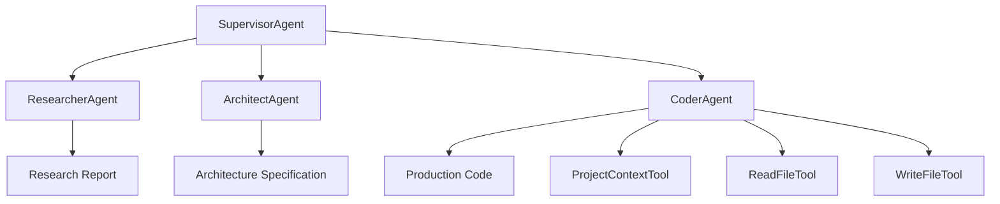

# 🤖 Quarkus AI Agent Swarm

> **An intelligent multi-agent system for automated software development using Quarkus and LangChain4j**


## 🌟 Overview

The **Quarkus AI Agent Swarm** is a sophisticated agentic AI system that automates the complete software development lifecycle through coordinated multi-agent collaboration. Built with Quarkus and powered by Anthropic's Claude models via LangChain4j, this system transforms high-level requirements into production-ready code through a structured workflow of specialized AI agents.

### ✨ Key Features

- 🎯 **Multi-Agent Architecture**: Four specialized agents working in perfect coordination
- 🔄 **Automated Workflow**: Research → Architecture → Implementation pipeline
- 🛠️ **File System Integration**: Direct code generation and project creation
- 📋 **Test-Driven Development**: Built-in TDD methodology support
- 🚀 **Quarkus Native**: High-performance, cloud-native architecture
- 🧠 **Claude Integration**: Advanced reasoning with Anthropic's latest models

## 🏗️ System Architecture

### Agent Hierarchy



### 🎭 Agent Roles & Responsibilities

#### 1. 🎬 **SupervisorAgent**
- **Role**: Orchestrator and workflow coordinator
- **Responsibility**: Ensures proper agent sequencing and validates deliverables
- **Workflow**: Enforces Research → Architecture → Implementation sequence
- **Tools**: AgentOrchestrator for inter-agent communication

#### 2. 🔍 **ResearcherAgent**
- **Role**: Requirements analyst and technology researcher
- **Input**: User requirements and project specifications
- **Output**: Comprehensive research report covering:
  - Problem analysis and scope definition
  - Technology recommendations and trade-offs
  - Implementation approaches and best practices
  - Risk assessment and mitigation strategies
  - Reference documentation and resources

#### 3. 🏛️ **ArchitectAgent**
- **Role**: System architect and design specialist
- **Input**: Research findings and requirements
- **Output**: Detailed architecture specification including:
  - High-level system overview and component design
  - Technology stack selection with justifications
  - Module responsibilities and interaction patterns
  - Data models, APIs, and integration points
  - Security considerations and scalability planning
  - Deployment and operational guidelines

#### 4. 💻 **CoderAgent**
- **Role**: Implementation specialist and code generator
- **Input**: Architecture specification and design requirements
- **Output**: Production-ready code implementation featuring:
  - Complete source code with proper structure
  - Comprehensive unit and integration tests
  - Configuration files and setup documentation
  - Build scripts and deployment manifests
- **Methodology**: Test-Driven Development (TDD)
- **Tools**: File system manipulation and project analysis tools

## 🛠️ Advanced Tool System

### CoderAgent Tools

#### 📁 **ProjectContextTool**
```java
// Analyze project structure and get comprehensive overview
analyzeProject(String projectPath)

// Extract specific files matching patterns
getProjectFiles(String projectPath, String filePattern)
```

**Capabilities:**
- Project structure visualization with file type icons
- File statistics and size analysis
- Key configuration file content extraction
- Smart pattern matching for file discovery

#### 📖 **ReadFileTool**
```java
// Read file content safely
readFile(String filePath)

// Check file existence before reading
fileExists(String filePath)
```

**Features:**
- Safe file reading with error handling
- Existence validation to prevent read errors
- Support for relative and absolute paths

#### ✍️ **WriteFileTool**
```java
// Create or overwrite files with content
writeFile(String content, String filePath)

// Append content to existing files
appendToFile(String content, String filePath)
```

**Advanced Features:**
- Automatic directory creation for nested paths
- Content validation and null-safety checks
- Relative path conversion and normalization
- Comprehensive error reporting and logging

## ⚙️ Configuration & Setup

### Prerequisites

- **Java**: Version 21 (GraalVM recommended)
- **Maven**: 3.8+ (wrapper included)
- **Anthropic API Key**: Required for Claude model access

### Environment Setup

1. **Configure Java Environment**
   ```bash
   # Using SDKMAN (recommended)
   sdk install java 21.0.8-graal
   sdk use java 21.0.8-graal
   
   # Or set JAVA_HOME manually
   export JAVA_HOME=/path/to/java21
   ```

2. **Set API Key**
   ```bash
   export ANTHROPIC_API_KEY=your_anthropic_api_key_here
   ```

3. **Verify Configuration**
   ```bash
   java -version  # Should show Java 21
   echo $ANTHROPIC_API_KEY  # Should display your API key
   ```

### Model Configuration

The system uses Anthropic Claude Opus with optimized settings:

```properties
# Agent Model Configuration
quarkus.langchain4j.{agent}.chat-model.provider=anthropic
quarkus.langchain4j.anthropic.{agent}.api-key=${ANTHROPIC_API_KEY}
quarkus.langchain4j.anthropic.{agent}.chat-model.model-name=claude-opus-4-1-20250805
quarkus.langchain4j.anthropic.{agent}.chat-model.temperature=0.1
quarkus.langchain4j.anthropic.{agent}.chat-model.max-tokens=1000
```

**Optimizations:**
- **Low Temperature (0.1)**: Ensures consistent, deterministic outputs
- **Controlled Token Limits**: Prevents excessive API usage
- **Request/Response Logging**: Full observability for debugging

## 🚀 Usage Guide

### Quick Start

1. **Build the Application**
   ```bash
   ./mvnw clean compile
   ```

2. **Run in Development Mode**
   ```bash
   ./mvnw quarkus:dev
   ```

3. **Execute Agent Workflow**
   The system automatically executes the demo workflow creating a Quarkus calculator REST API.

### Custom Workflows

Modify the request in `AgentApplication.java`:

```java
public class AgentApplication implements QuarkusApplication {
    @Inject
    SupervisorAgent supervisorAgent;

    @Override
    public int run(String... args) throws Exception {
        String result = supervisorAgent.chat("Your custom requirement here");
        System.out.println(result);
        return 0;
    }
}
```

### Example Workflows

#### 1. **REST API Development**
```java
supervisorAgent.chat("Create a REST API for managing user profiles with CRUD operations");
```

#### 2. **Microservice Architecture**
```java
supervisorAgent.chat("Design and implement a microservice for order processing with event sourcing");
```

#### 3. **Data Processing Pipeline**
```java
supervisorAgent.chat("Build a real-time data processing pipeline using Kafka and MongoDB");
```

## 📁 Project Structure

```
quarkus-ai-agent/
├── src/main/java/com/github/dloiacono/ai/agents/
│   ├── AgentApplication.java           # Main application entry point
│   ├── MainApp.java                   # Quarkus runner
│   ├── SupervisorAgent.java           # Workflow orchestrator
│   ├── ResearcherAgent.java          # Requirements analyst
│   ├── ArchitectAgent.java           # System designer
│   ├── CoderAgent.java               # Code implementer
│   └── tools/
│       ├── AgentOrchestrator.java    # Inter-agent communication
│       ├── ProjectContextTool.java   # Project analysis
│       ├── ReadFileTool.java         # File reading operations
│       └── WriteFileTool.java        # File writing operations
├── src/main/resources/
│   └── application.properties         # Configuration settings
├── quarkus-calculator-api/           # Generated project output
└── target/run-test/                  # Tool execution workspace
```

## 🔧 Development & Deployment

### Building the Application

```bash
# Development build
./mvnw clean compile

# Production package
./mvnw package

# Uber JAR (single file distribution)
./mvnw package -Dquarkus.package.jar.type=uber-jar
```

### Native Compilation

```bash
# Native executable (requires GraalVM)
./mvnw package -Dnative

# Containerized native build
./mvnw package -Dnative -Dquarkus.native.container-build=true
```

### Running Options

```bash
# Development mode (with hot reload)
./mvnw quarkus:dev

# JVM mode
java -jar target/quarkus-app/quarkus-run.jar

# Native executable
./target/quarkus-ai-agent-1.0-SNAPSHOT-runner
```

## 🧪 Testing & Validation

### Agent Workflow Testing

The system includes comprehensive validation at each stage:

1. **Research Phase Validation**
   - Requirement completeness check
   - Technology recommendation validation
   - Risk assessment verification

2. **Architecture Phase Validation**
   - Design consistency verification
   - Component interaction validation
   - Security requirement compliance

3. **Implementation Phase Validation**
   - Code quality assessment
   - Test coverage verification
   - Build success confirmation

### File Generation Verification

The CoderAgent includes built-in validation:
- File creation success confirmation
- Content integrity verification
- Directory structure validation
- Build system integration checks

## 🔍 Monitoring & Observability

### Request/Response Logging

All agent interactions are logged with full request/response details:

```properties
quarkus.langchain4j.anthropic.{agent}.chat-model.log-requests=true
quarkus.langchain4j.anthropic.{agent}.chat-model.log-responses=true
```

### Error Handling

Comprehensive error handling includes:
- API communication failures
- File system operation errors
- Tool execution exceptions
- Agent workflow interruptions

## 🤝 Contributing

### Development Setup

1. Fork the repository
2. Create a feature branch
3. Set up development environment
4. Run tests and validation
5. Submit pull request

### Code Standards

- Java 21 features encouraged
- Comprehensive JavaDoc documentation
- Test-driven development approach
- Quarkus best practices adherence

## 📚 Advanced Usage

### Custom Agent Development

Extend the system with custom agents:

```java
@RegisterAiService(modelName = "custom", tools = {CustomTool.class})
public interface CustomAgent {
    @SystemMessage("Your agent's system message here")
    String processRequest(String input);
}
```

### Tool Development

Create specialized tools for your domain:

```java
@ApplicationScoped
public class CustomTool {
    @Tool("Tool description")
    public String customOperation(@P("Parameter description") String input) {
        // Tool implementation
        return result;
    }
}
```

## 🐛 Troubleshooting

### Common Issues

**API Key Issues**
```bash
# Verify API key is set
echo $ANTHROPIC_API_KEY

# Check API key permissions
curl -H "Authorization: Bearer $ANTHROPIC_API_KEY" https://api.anthropic.com/v1/models
```

**Java Version Conflicts**
```bash
# Check Java version
java -version

# Verify Maven compiler target
./mvnw help:active-profiles
```

**File Generation Issues**
- Check target directory permissions: `target/run-test/`
- Verify relative path handling in WriteFileTool
- Review agent tool usage in logs

## 📄 License

This project is licensed under the MIT License - see the [LICENSE](LICENSE) file for details.

## 🙏 Acknowledgments

- **Quarkus Team** for the amazing framework
- **LangChain4j** for AI integration capabilities  
- **Anthropic** for Claude's exceptional reasoning abilities
- **Community Contributors** for continuous improvements

---

**Built with ❤️ using Quarkus, LangChain4j, and the power of AI collaboration**
